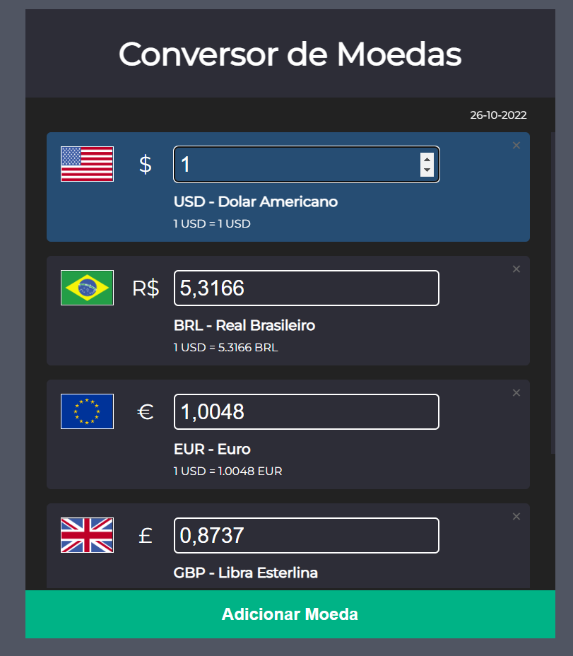

# currency-converter-app
Conversor Internacional de Moedas

Convesor internacional de várias moedas pelo mundo, projeto feito num canal de programação no youtube.

Tecnologias usadas: HTML5, CSS3, e Javascript.

Aplicação com comunicação externa de uma Api para pegar os dados em tempo de real de cada moeda.

  

